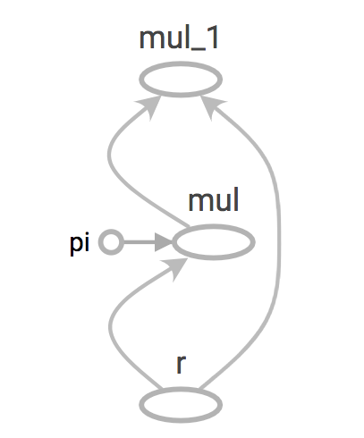

Tensorflow has been an open source software library for high performance numerical computation which became highly popular among Machine learning practitioners ever since it was open sourced few years back by Google. It has become one of the go to frameworks for deep learning projects because of it's richness of features and ability to abstract lot of boilerplate code and configurations without reducing the flexibility and scalability.
However, this article will try to discuss some of the underlying nuts and bolts which will not be necessary when using high level APIs like Keras or Tensorflow estimators.

**_What is a graph?_**

Tensorflow has a lazy evaluation in other words Tensorflow will first create a computational graph with the operations as the nodes of the graph and tensors to it's edges and the execution happens when the graph executed in a session. This is commonly called as [dataflow](https://en.wikipedia.org/wiki/Dataflow_programming) programming model specially for parallel computing. 

for example in normal python
```python
a = 'Hello World'
print(a)
```
will print out **_Hello World_** in to the output but with Tensorflow,
```python
a = tf.constant("Hello World")
print(a)
```
will print out **_Tensor("Const:0", shape=(), dtype=string)_** to the output. That's because we haven't yet run the computation graph in a session so, Tensorflow has still created the graph only.

**_So, What are the benefits of using graphs?_**

- **Parallelism.** By using explicit edges to represent dependencies between operations, it is easy for the system to identify operations that can execute in parallel.

- **Distributed execution.** By using explicit edges to represent the values that flow between operations, it is possible for TensorFlow to partition your program across multiple devices (CPUs, GPUs, and TPUs) attached to different machines. TensorFlow inserts the necessary communication and coordination between devices.

- **Compilation.** TensorFlow's XLA compiler can use the information in your dataflow graph to generate faster code, for example, by fusing together adjacent operations.

- **Portability.** The dataflow graph is a language-independent representation of the code in your model. You can build a dataflow graph in Python, store it in a SavedModel, and restore it in a C++ program for low-latency inference.

**_Let's build a simple graph and execute it_**

Let's create a computation graph to calculate the area of a circle. The mathematical function to calculate an area of a circle is: a = πr<sup>2<sup>

First let's define our graph:
```python
pi = tf.constant(3.14, name="pi")
r = tf.placeholder(tf.float32, name="r")
    
a = pi * r * r
```
We have a constant called "pi" and a placeholder for "r" which will be feed in to this graph as an input.

Let's inspect the graph and values of the nodes. By default Tensorflow will create a graph for you but you can create your own graph too.
```python
graph = tf.get_default_graph()
print(graph.get_operations())
```
The output will look something like this:
[<tf.Operation 'pi' type=Const>, <tf.Operation 'r' type=Placeholder>, <tf.Operation 'mul' type=Mul>, <tf.Operation 'mul_1' type=Mul>]




To run this graph, let's create a Tensorflow session and run that session with r = 5 as an input.

```python
with tf.Session() as sess:
    print(a.eval(feed_dict={r: [5]}))
```

You can provide values for placeholders defined earlier to the session as python dictionary where the key is your placeholder name and value can be a list.

This is a sneak peak in to Tensorflow's graph and sessions. How these can be used with Neural Networks can be discussed in a future post. However, with new high level APIs like Keras and Tensorflow Estimators the developers are no longer need to worry about these underlying concepts but still having a knowledge in inner workings could be really beneficial in the long run.
