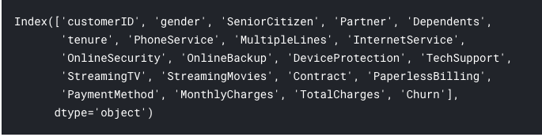
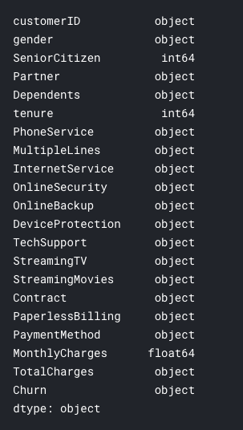
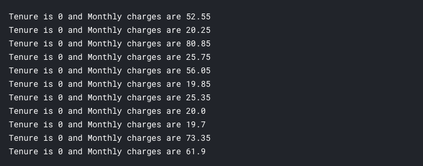
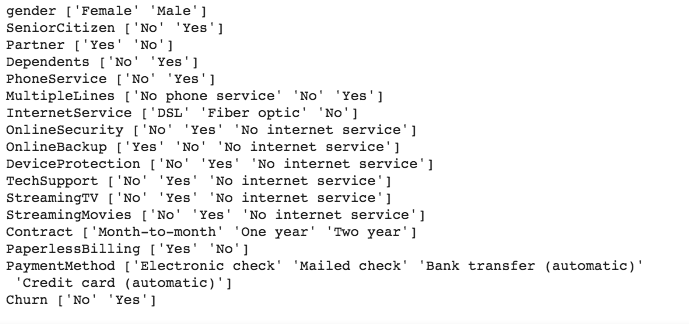

Customer churn or customer attrition is the loss of existing customers from a service or a company and that is a vital part of many businesses to understand in order to provide more relevant and quality services and retain the valuable customers to increase their profitability. In this post we will try to predict customer churn for a telco operator. We will be using [a dataset from IBM Watson analytics community](https://community.watsonanalytics.com/wp-content/uploads/2015/03/WA_Fn-UseC_-Telco-Customer-Churn.csv)

**Let's dive in:**

```python
import numpy as np
import pandas as pd

from matplotlib import pyplot as plt

from sklearn.model_selection import train_test_split

from tensorflow.keras import Sequential
from tensorflow.keras.layers import Dense
from tensorflow.keras.models import load_model
```
first things first, import the necessary libraries and make sure you have downloaded the csv file in to the working directory.
```python
data = pd.read_csv('WA_Fn-UseC_-Telco-Customer-Churn.csv')
```
We'll then read the csv file in to a pandas dataframe. In this post we are using a relatively small dataset which can be easily stored in the memory but if you are using a bigger file(s) it's highly recommended to look in to [Tensorflow Dataset API](https://www.tensorflow.org/guide/datasets) which is beyond the scope of this post.

Before moving on to building our model, we have to do some important things, that's to get an idea about our dataset, apply data wrangling if necessary, and identify the features for our model.

You can run:
```python
data.head()
```

To see a gist of the dataset.

```python
data.columns
```


Let's check what these columns really are:
```python
data.dtypes
```


It's quite obvious that we have some issues to fix in this dataset. 

- Senior Citizen column has two values, Yes and No but here it's 1 and 0 and column is a int64 type. Let's fix that.
first we need to replace 1s and 0s with Yes and No:
```python
data.SeniorCitizen.replace([0, 1], ["No", "Yes"], inplace= True)
```

- TotalCharges column should be numerical.
```python
data.TotalCharges = data.TotalCharges.astype(float)
``` 
But when we try to convert this column in to float data type it raises an error. That's because this column has some blank cells. Let's go a bit deep in to this rabbit hole.
```python
for charge in data.TotalCharges:
  try:
    charge = float(charge)
  except:
    print("charge is: %s" % charge)
```
Checking in this way it shows that 11 rows has a space as TotalCharge. What do we do for this?
Let's check what are the MonthlyCharge and Tenure when TotalCharge is a space/blank value
```python
for i in range(len(data)):
    if data.TotalCharges[i] == " ":
        print("Tenure is %s and Monthly charges are %s" % (data.tenure[i], data.MonthlyCharges[i]))
```


So, it's obvious that total charges are blank when tenure is 0 in other words they are pretty new and short timed customers. Since their tenure is zero it's quite logical to think that their total charges as zero. Let's replace space in TotalCharges to 0 and convert the column to float data type.
```python
data.TotalCharges.replace([" "], ["0"], inplace= True)
data.TotalCharges = data.TotalCharges.astype(float)
```

**Let's do some normalizations**

CustomerID, just as value, will not have any affect in customer churn so, let;s first drop that column.
```python
data.drop("customerID", axis= 1, inplace= True)
```
```python
for col in data.dtypes[data.dtypes == object].index:
    print(col, data[col].unique())
```


Now we have 3 numerical columns and rest are categorical. In order to normalize the numerical columns let's divide the values of each column by the max value of the relevant column. This will make sure all the values are between 0 - 1 thus, helping to reduce those values giving unwanted weighing on final model.

Since our labels will be Churn and it has Yes, No values, let's replace Yes with one and No with zero so our model will be a binary classification model.
```python
data.Churn.replace(["Yes", "No"], [1, 0], inplace= True)
```
Next, we should encode all the categorical data in to one-hot encoding. Pandas have a quite easy way to do that:
```python
data = pd.get_dummies(data)
```

**Prepare the data for training**

```python
X = data.drop("Churn", axis= 1)
y = data.Churn
```
Inputs to the model will be X and it has all the columns except Churn which is our label thus, assign it to y. To train and test our model we should split our dataset. This split will create 20% of data for testing and 80% for training.
```python
X_train, X_test, y_train, y_test = train_test_split(X, y, test_size= 0.2, random_state= 1234)
```

**Training**

Creating the model:
```python
model = Sequential()
model.add(Dense(16, input_dim=X_train.shape[1], activation='relu'))
model.add(Dense(8, activation='relu'))
model.add(Dense(1, activation='sigmoid'))
```
Compiling the model:
```python
model.compile(loss='binary_crossentropy', optimizer='adam', metrics=['accuracy'])
```
Fitting the model for 150 epochs with 10 as batch size:
```python
model.fit(X_train, y_train, epochs=150, batch_size=10)
```
This will start training your model on the training data split we created before. This will take a little while to finish. The model I trained had a accuracy of 84% on the training set which is not phenomenal.

**Evaluating and saving the model**

```python
_, accuracy = model.evaluate(X_test, y_test)
```
For the model I trained on I got 77% accuracy on test set. You will get different values. However, we have ~8% difference in accuracy on training set and test set which may be due to overfitting. However, diagnosing these errors could be discussed in a separate post.
```python
model.save('my_model.h5')
```
You can save your model for future inferences but keep in mind that you have to do the same transformations, normalizations to the data that we did for the above dataset to your data before making inferences on this model.

There are lot of things to improve in this model as well as diagnose some issue. Still you can play around with different hyper parameters and of course different other models like boosting, decision trees, SVMs and other classical algorithms and compare the results.

Thanks!