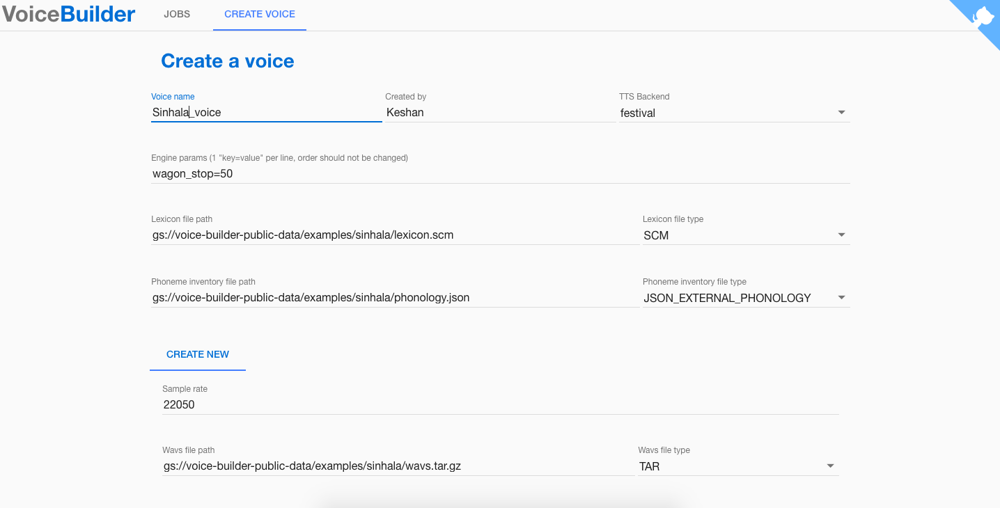

Speech synthesize has become more human like within last few years and gained a higher momentum in research specially at tech giants. New techniques like [DeepMind's WaveNet](https://deepmind.com/blog/wavenet-generative-model-raw-audio/) has almost achieved human level naturalness. In this post we are not going to talk about such techniques instead we will be looking at available resources, tools and novel ways to build text to speech voices for languages which don't have lot of resources available for such researches or languages which are not in the priority list of many tech companies due to small number of native speakers or due to low market value.

**Data Collection through crowdsourcing**

Main challenge for these languages are the data collection process which is very expensive and time consuming. Couple of years ago [Google proposed a crowdsourced approach to collect voice](https://ai.google/research/pubs/pub45300) data to build a high quality TTS voice for Bangla and then after few other languages including Sinhala. In this method they collect voice samples from multiple speakers who have quite similar speaker profiles or in other words voices with similar features through a platform called ChiChat inside a quiet room which doesn't need to be an expensive high quality studio with a fan-less laptop and a microphone altogether they will cost around $1500. Compared to the costs incurred to do a data collection in normal procedure this is really cheap and affordable for many research groups. The data for [Sinhala](http://openslr.org/30/), [Nepali](http://openslr.org/43/), [Khmer](http://openslr.org/42/), [Bangla](http://openslr.org/37/), [Javanese](http://openslr.org/41/) and [Sundanese](http://openslr.org/44/) have already been open sourced.

Apart from these recording data a TTS needs few other resources lexicon, phonology and Text normalization just to name a few. Google has also open sourced these data and necessary codes and scripts [in GitHub](https://github.com/googlei18n/language-resources)

**Building a voice**

After the data collection and gathering other necessary resources. We can then worry about text normalization. You can find the text normalizations for Sinhala [here](https://github.com/googlei18n/language-resources/tree/master/si/textnorm). [This paper](https://ai.google/research/pubs/pub47344) explains text normalization in detail.

With all these in hand we can start the process of [voice building](https://ai.google/research/pubs/pub47347) for that Google has open sourced a tool called [voice builder](https://opensource.google.com/projects/voice-builder) using that tool anybody with these resources can build a voice without even any technical knowledge. However [this tool](https://ai.google/research/pubs/pub46977) current support only two TTS backends namely Festival and Merlin but this tool has written in a way where anyone can plugin whatever their preferred algorithm and build new voices with better quality using the same pipeline with no hassle. Current two open sourced TTS backends produce good voices but compared to Google's voice which uses this same set of data and resources on their proprietary algorithms, the quality could be improved drastically with a better algorithm and better techniques.

Hope these list will be beneficial for someone in start building custom voices.

Thanks!